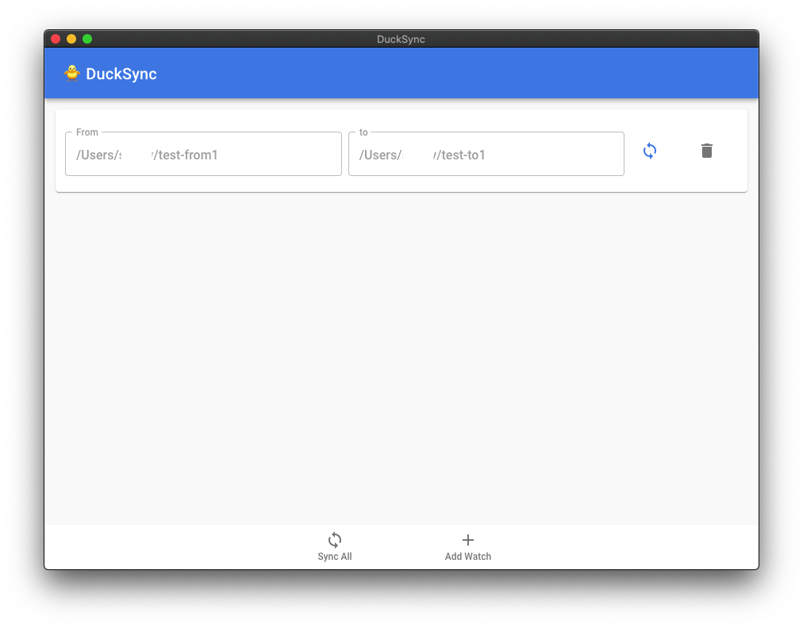

# 🐥 DuckSync


A simple file sync app based on watchman, rsync.



It syncs all files from A(from) directory to B(to) directory in real time.

App keep watches file system changes(create, delete, change, rename etc..) of A(from) directory, do sync job to B(to) directory when files changed.

If you used symbolic link backup via DropBox, this app will be useful.

This project was born because [dropbox has removed symbolic link backup feature](https://help.dropbox.com/en-us/installs-integrations/sync-uploads/symlinks) :(

currently I tested only at macOS. I didn't tested on Windows, Linux. so it doesn't guarantee work properly.

## Production Usage

First, you have to install watchman. and rsync _(if needed. by default, macOS already have installed rsync.)_

```
brew install watchman rsync
```

## Development

```

```
